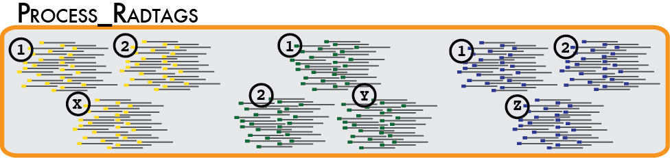

<section class="manual_section">

<h3 class="sections">4. Running the pipeline </h3>

<h4 class="subsections">4.1. Clean the data</h4>

 In a typical analysis, data will be received from an Illumina sequencer, or some other type of sequencer as FASTQ files. The first requirement is to demultiplex, or sort, the raw data to recover the individual samples in the Illumina library. While doing this, we will use the Phred scores provided in the FASTQ files to discard sequencing reads of low quality. These tasks are accomplished using the **process_radtags** program.

http://catchenlab.life.illinois.edu/stacks/manual/process_radtags.png

Some things to consider when running this program:

<li>**process_radtags** can handle both single-end or paired-end Illumina sequencing.
    
  <li>The raw data can be compressed, or gzipped (files end with a "`.gz`" suffix).
    <li> You can supply a list of barcodes, or indexes, to **process_radtags** in order for it to demultiplex your samples. These barcodes can be single-end barcodes or combinatorial barcodes (pairs of barcodes, one on each of the paired reads). Barcodes are specified, one per line (or in tab separated pairs per line), in a text file.
       <li> If, in addition to your barcodes, you also supply a sample name in an extra column within the barcodes file, **process_radtags** will name your output files according to sample name instead of barcode.
   <li> If you believe your reads may contain adapter contamination, **process_radtags** can filter it out.
   <li> You can supply the restriction enzyme used to construct the library. In the case of double-digest RAD, you can supply both restriction enzymes.
  <li>  If instructed, (`-r` command line option), **process_radtags** will correct barcodes and restriction enzyme sites that are within a certain distance from the true barcode or restriction enzyme cutsite.

<h5 class="subsubsections">4.1.1. Understanding barcodes/indexes and specifying the barcode type</h5>

Genotype by sequencing libraries sample the genome by selecting DNA adjacent to one or more restriction enzyme cutsites. By reducing the amount of total DNA sampled, most researchers will multiplex many samples into one molecular library. Individual samples are demarcated in the library by ligating an oligo barcode onto the restriction enzyme-associated DNA for each sample. Alternatively, an index barcode is used, where the barcode is located upstream of the sample DNA within the sequencing adaptor. Regardless of the type of barcode used, after sequencing, the data must be demultiplexed so the samples are again separated. The `process_radtags` program will perform this task, but we much specify the type of barcodes used, and where to find them in the sequencing data.

There are a number of different configurations possible, each of them is detailed below.

<ol>
    <li>
        If your data are <strong>single-end</strong> or <strong>paired-end</strong>, with an inline barcode present only on the single-end (marked in red): 
        
@HWI-ST0747:188:C09HWACXX:1:1101:2968:2083 1:N:0:
TTATGATGCAGGACCAGGATGACGTCAGCACAGTGCGGGTCCTCCATGGATGCTCCTCGGTCGTGGTTGGGGGAGGAGGCA
+
@@@DDDDDBHHFBF@CCAGEHHHBFGIIFGIIGIEDBBGFHCGIIGAEEEDCC;A?;;5,:@A?=B5559999B@BBBBBA
@HWI-ST0747:188:C09HWACXX:1:1101:2863:2096 1:N:0:
TTATGATGCAGGCAAATAGAGTTGGATTTTGTGTCAGTAGGCGGTTAATCCCATACAATTTTACACTTTATTCAAGGTGGA
+
CCCFFFFFHHHHHJJGHIGGAHHIIGGIIJDHIGCEGHIFIJIH7DGIIIAHIJGEDHIDEHJJHFEEECEFEFFDECDDD
@HWI-ST0747:188:C09HWACXX:1:1101:2837:2098 1:N:0:
GTGCCTTGCAGGCAATTAAGTTAGCCGAGATTAAGCGAAGGTTGAAAATGTCGGATGGAGTCCGGCAGCAGCGAATGTAAA

    Then you can specify the ``--inline_null`` flag to ** process_radtags**. This is also the 
    default behavior and the flag can be ommitted in this case.
    

</li>

<li>
If your data are <strong>single-end</strong> or <strong>paired-end</strong>, with a single index barcode (in blue): 

@9432NS1:54:C1K8JACXX:8:1101:6912:1869 1:N:0:ATGACT
TCAGGCATGCTTTCGACTATTATTGCATCAATGTTCTTTGCGTAATCAGCTACAATATCAGGTAATATCAGGCGCA
+
CCCFFFFFHHHHHJJJJJJJJIJJJJJJJJJJJHIIJJJJJJIJJJJJJJJJJJJJJJJJJJGIJJJJJJJHHHFF
@9432NS1:54:C1K8JACXX:8:1101:6822:1873 1:N:0:ATGACT
CAGCGCATGAGCTAATGTATGTTTTACATTCCAGAAAGAGAGCTACTGCTGCAGGTTGTGATAAAATAAAGTAAGA
+
B@@FFFFFHFFHHJJJJFHIJHGGGHIJIIJIJCHJIIGGIIIGGIJEHIJJHII?FFHICHFFGGHIIGG@DEHH
@9432NS1:54:C1K8JACXX:8:1101:6793:1916 1:N:0:ATGACT
TTTCGCATGCCCTATCCTTTTATCACTCTGTCATTCAGTGTGGCAGCGGCCATAGTGTATGGCGTACTAAGCGAAA
+
@C@DFFFFHGHHHGIGHHJJJJJJJGIJIJJIGIJJJJHIGGGHGII@GEHIGGHDHEHIHD6?493;AAA?;=;=

Then you can specify the `--index_null` flag to **process_radtags**.

</li>

<li>
If your data are <strong>single-end</strong> with both an inline barcode (in red) and an index barcode (in blue): 

@9432NS1:54:C1K8JACXX:8:1101:6912:1869 1:N:0:ATCACG
TCACGCATGCTTTCGACTATTATTGCATCAATGTTCTTTGCGTAATCAGCTACAATATCAGGTAATATCAGGCGCA
+
CCCFFFFFHHHHHJJJJJJJJIJJJJJJJJJJJHIIJJJJJJIJJJJJJJJJJJJJJJJJJJGIJJJJJJJHHHFF
@9432NS1:54:C1K8JACXX:8:1101:6822:1873 1:N:0:ATCACG
GTCCGCATGAGCTAATGTATGTTTTACATTCCAGAAAGAGAGCTACTGCTGCAGGTTGTGATAAAATAAAGTAAGA
+
B@@FFFFFHFFHHJJJJFHIJHGGGHIJIIJIJCHJIIGGIIIGGIJEHIJJHII?FFHICHFFGGHIIGG@DEHH
@9432NS1:54:C1K8JACXX:8:1101:6793:1916 1:N:0:ATCACG
GTCCGCATGCCCTATCCTTTTATCACTCTGTCATTCAGTGTGGCAGCGGCCATAGTGTATGGCGTACTAAGCGAAA
+
@C@DFFFFHGHHHGIGHHJJJJJJJGIJIJJIGIJJJJHIGGGHGII@GEHIGGHDHEHIHD6?493;AAA?;=;=

Then you can specify the `--inline_index` flag to **process_radtags**.

</li>
<li>
If your data are <strong>paired-end</strong> with an inline barcode on the single-end (in red) and an index barcode (in blue): 

@9432NS1:54:C1K8JACXX:7:1101:5584:1725 1:N:0:CGATGT
ACTGGCATGATGATCATAGTATAACGTGGGATACATATGCCTAAGGCTAAAGATGCCTTGAAGCTTGGCTTATGTT
+
#1=DDDFFHFHFHIFGIEHIEHGIIHFFHICGGGIIIIIIIIAEIGIGHAHIEGHHIHIIGFFFGGIIIGIIIEE7
@9432NS1:54:C1K8JACXX:7:1101:5708:1737 1:N:0:CGATGT
TTCGACATGTGTTTACAACGCGAACGGACAAAGCATTGAAAATCCTTGTTTTGGTTTCGTTACTCTCTCCTAGCAT
+
#1=DFFFFHHHHHJJJJJJJJJJJJJJJJJIIJIJJJJJJJJJJIIJJHHHHHFEFEEDDDDDDDDDDDDDDDDD@

@9432NS1:54:C1K8JACXX:7:1101:5584:1725 2:N:0:CGATGT
AATTTACTTTGATAGAAGAACAACATAAGCCAAGCTTCAAGGCATCTTTAGCCTTAGGCATATGTATCCCACGTTA
+
@@@DFFFFHGHDHIIJJJGGIIIEJJJCHIIIGIJGGEGGIIGGGIJIJIHIIJJJJIJJJIIIGGIIJJJIICEH
@9432NS1:54:C1K8JACXX:7:1101:5708:1737 2:N:0:CGATGT
AGTCTTGTGAAAAACGAAATCTTCCAAAATGCTAGGAGAGAGTAACGAAACCAAAACAAGGATTTTCAATGCTTTG
+
C@CFFFFFHHHHHJJJJJJIJJJJJJJJJJJJJJIJJJHIJJFHIIJJJJIIJJJJJJJJJHGHHHHFFFFFFFED

Then you can specify the `--inline_index` flag to **process_radtags**.

</li>

<li>
If your data are <strong>paired-end</strong> with indexed barcodes on the single and paired-ends (in blue): 

@9432NS1:54:C1K8JACXX:7:1101:5584:1725 1:N:0:ATCACG+CGATGT
ACTGGCATGATGATCATAGTATAACGTGGGATACATATGCCTAAGGCTAAAGATGCCTTGAAGCTTGGCTTATGTT
+
#1=DDDFFHFHFHIFGIEHIEHGIIHFFHICGGGIIIIIIIIAEIGIGHAHIEGHHIHIIGFFFGGIIIGIIIEE7
@9432NS1:54:C1K8JACXX:7:1101:5708:1737 1:N:0:ATCACG+CGATGT
TTCGACATGTGTTTACAACGCGAACGGACAAAGCATTGAAAATCCTTGTTTTGGTTTCGTTACTCTCTCCTAGCAT
+
#1=DFFFFHHHHHJJJJJJJJJJJJJJJJJIIJIJJJJJJJJJJIIJJHHHHHFEFEEDDDDDDDDDDDDDDDDD@

@9432NS1:54:C1K8JACXX:7:1101:5584:1725 2:N:0:ATCACG+CGATGT
AATTTACTTTGATAGAAGAACAACATAAGCCAAGCTTCAAGGCATCTTTAGCCTTAGGCATATGTATCCCACGTTA
+
@@@DFFFFHGHDHIIJJJGGIIIEJJJCHIIIGIJGGEGGIIGGGIJIJIHIIJJJJIJJJIIIGGIIJJJIICEH
@9432NS1:54:C1K8JACXX:7:1101:5708:1737 2:N:0:ATCACG+CGATGT
AGTCTTGTGAAAAACGAAATCTTCCAAAATGCTAGGAGAGAGTAACGAAACCAAAACAAGGATTTTCAATGCTTTG
+
C@CFFFFFHHHHHJJJJJJIJJJJJJJJJJJJJJIJJJHIJJFHIIJJJJIIJJJJJJJJJHGHHHHFFFFFFFED

Then you can specify the --index_index flag to process_radtags.

</li>

<li>
If your data are <strong>paired-end</strong> with inline barcodes on the single and paired-ends (in red): 

@9432NS1:54:C1K8JACXX:7:1101:5584:1725 1:N:0:
ACTGGCATGATGATCATAGTATAACGTGGGATACATATGCCTAAGGCTAAAGATGCCTTGAAGCTTGGCTTATGTT
+
#1=DDDFFHFHFHIFGIEHIEHGIIHFFHICGGGIIIIIIIIAEIGIGHAHIEGHHIHIIGFFFGGIIIGIIIEE7
@9432NS1:54:C1K8JACXX:7:1101:5708:1737 1:N:0:
TTCGACATGTGTTTACAACGCGAACGGACAAAGCATTGAAAATCCTTGTTTTGGTTTCGTTACTCTCTCCTAGCAT
+
#1=DFFFFHHHHHJJJJJJJJJJJJJJJJJIIJIJJJJJJJJJJIIJJHHHHHFEFEEDDDDDDDDDDDDDDDDD@

@9432NS1:54:C1K8JACXX:7:1101:5584:1725 2:N:0:
AATTTACTTTGATAGAAGAACAACATAAGCCAAGCTTCAAGGCATCTTTAGCCTTAGGCATATGTATCCCACGTTA
+
@@@DFFFFHGHDHIIJJJGGIIIEJJJCHIIIGIJGGEGGIIGGGIJIJIHIIJJJJIJJJIIIGGIIJJJIICEH
@9432NS1:54:C1K8JACXX:7:1101:5708:1737 2:N:0:
AGTCTTGTGAAAAACGAAATCTTCCAAAATGCTAGGAGAGAGTAACGAAACCAAAACAAGGATTTTCAATGCTTTG
+
C@CFFFFFHHHHHJJJJJJIJJJJJJJJJJJJJJIJJJHIJJFHIIJJJJIIJJJJJJJJJHGHHHHFFFFFFFED

Then you can specify the `--inline_inline` flag to **process_radtags**.

</li>
